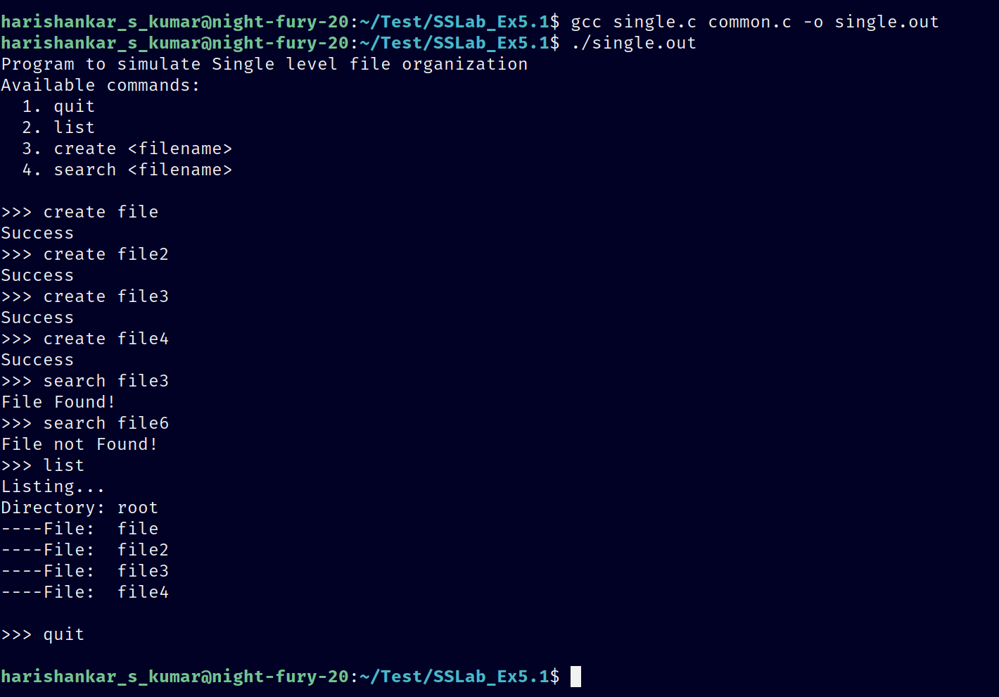
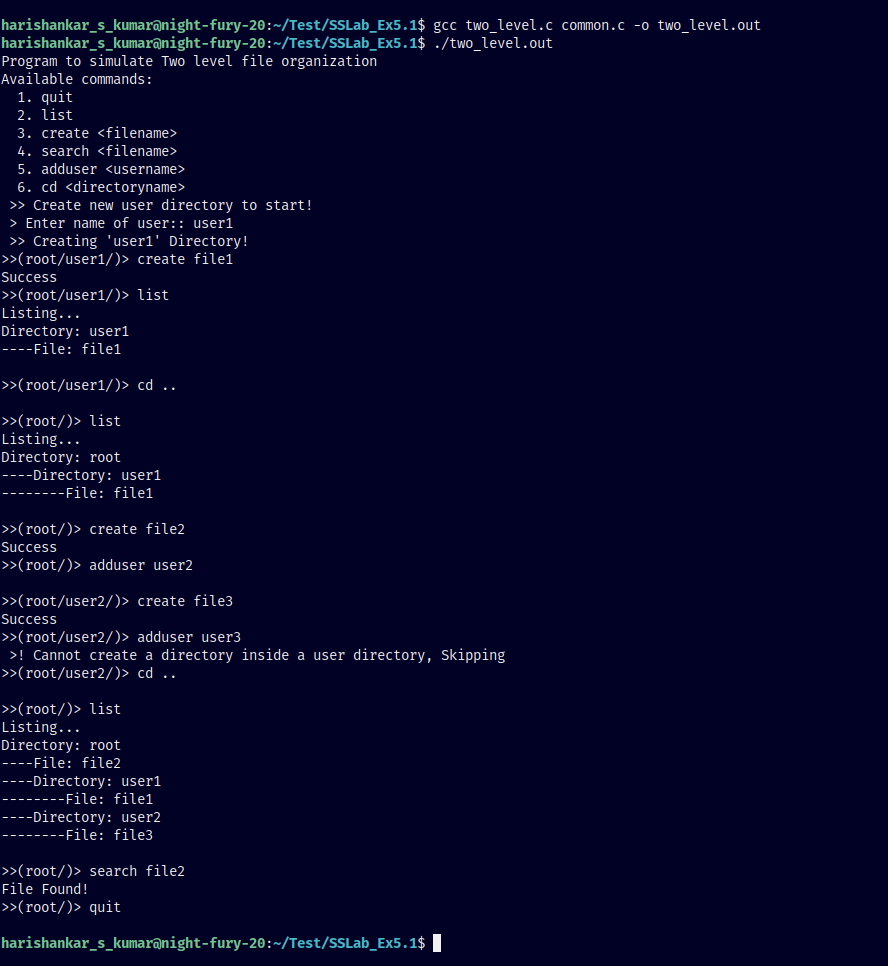
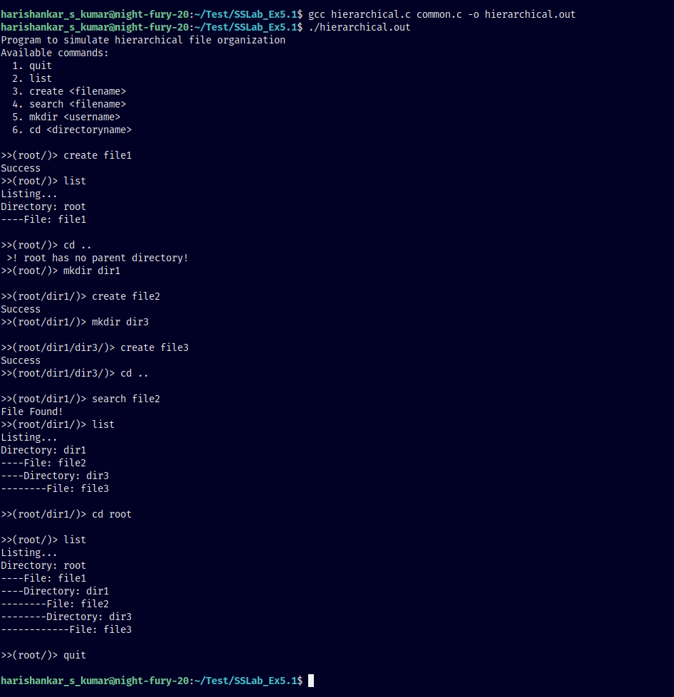

# FileOrganizationTechniques

This Lab Program was created to teach myself Header Files and MakeFiles

### Why are the programs large? 

> I wanted the programs to display meaningful errors (Anything better than nothing) instead of it straight up giving a segmentation fault

## Simulate the following file organization methods:
1. Single Level
2. Two Level
3. Hierarchical 

## Output
1. Single Level 

2. Two Level

3. Hierarchical

